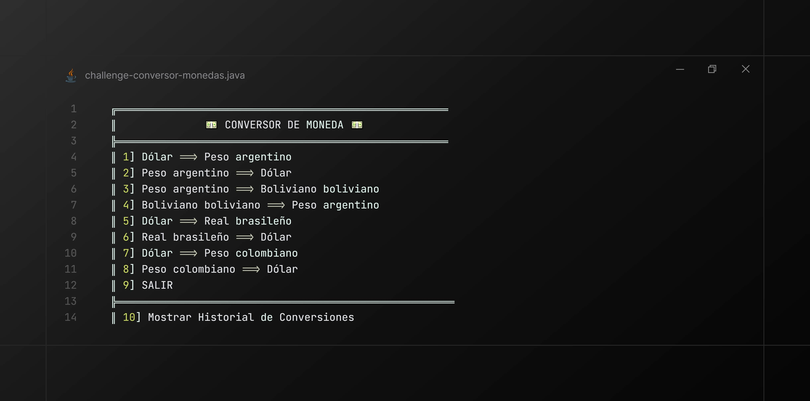
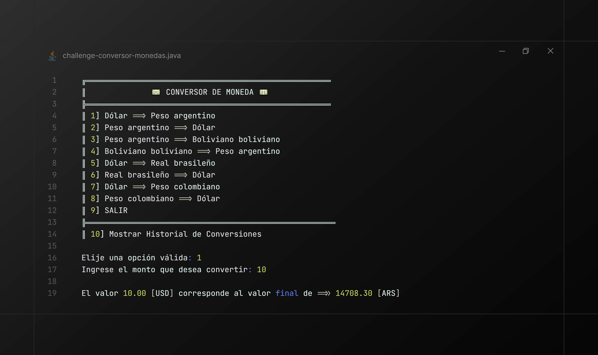
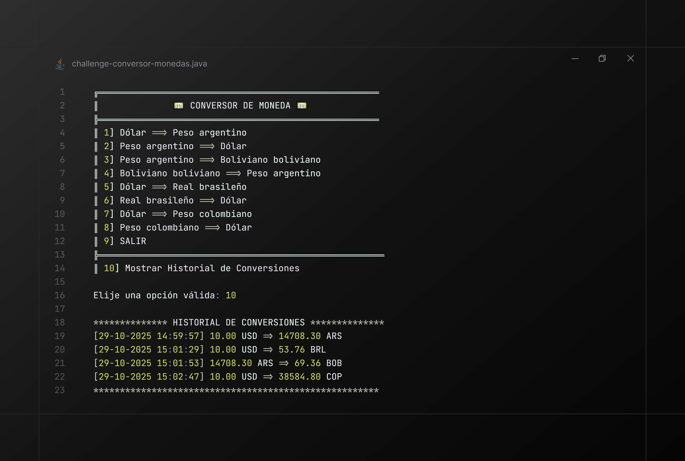
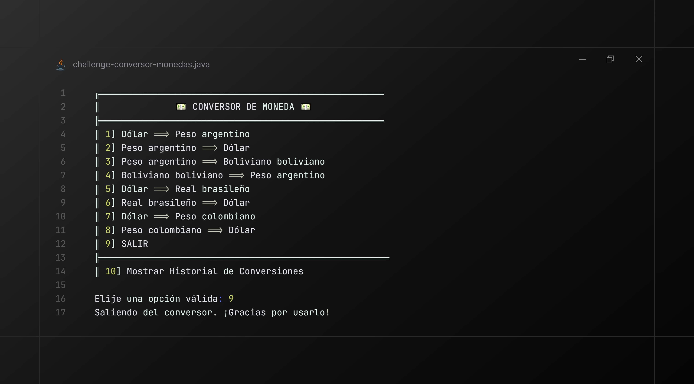
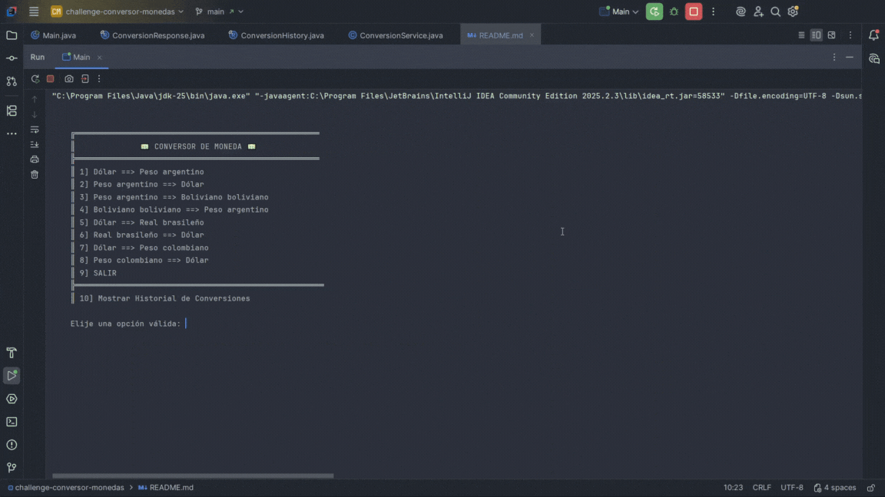

[//]: # (<p align="center">)

[//]: # (  )

[//]: # (</p>)

# 🌐 Conversor de Monedas

Este proyecto es una aplicación de consola que permite a los usuarios ingresar la cantidad de dinero y seleccionar la conversion  de origen/destino, mostrar historial de conversiones. Para realizar estas conversiones utilizaremos datos de cotización obtenidos de una API externa (exchangerate-api).

## ✨ Funcionalidades del Sistema

- **Integración con API Externa** Obtiene tipos de cambio actualizados en tiempo real de forma dinámica a través del servicio ExchangeRate-API.
- **Conversión de Monedas**	Permite calcular la equivalencia de un monto específico entre dos divisas elegidas por el usuario.
- **Historial de Conversiones** Mantiene un registro persistente de todas las conversiones realizadas, el cual puede ser consultado en cualquier momento.
- **Menú Interactivo** Interfaz de consola clara y guiada que facilita al usuario la selección de divisas de origen/destino y la ejecución de la conversión.
- **Manejo Robusto de Errores** Implementa lógica para gestionar fallos comunes, como problemas de conexión con la API o la entrada de datos inválida por parte del usuario.
## 🛠️ Tecnologías y Entorno de Desarrollo

Este proyecto fue construido utilizando los siguientes elementos:

* **Lenguaje:** Java Development Kit (**JDK 17** o superior).
* **Librería para JSON:** **Gson 2.10.1** (o superior) para el manejo y *parsing* de las respuestas de la API.
* **IDE (Opcional):** IntelliJ IDEA Community Edition.
* **Herramienta de Prueba (Opcional):** Postman, utilizada para verificar el *endpoint* de la API y la estructura de la respuesta JSON.

### **Configuración del Entorno (Guía Rápida)**

1.  Asegúrate de tener instalado el **Java JDK 17+**.
2.  **Obtención de Clave API:** Regístrate en **[ExchangeRate-API](https://www.exchangerate-api.com/)** para obtener tu clave. Deberás incluir esta clave en la configuración de tu proyecto para poder realizar las peticiones.
3.  **Importar Gson en IntelliJ (si aplica):**
    * Abre el proyecto y ve a *File* $\rightarrow$ *Project Structure* (o *Open Module Settings*).
    * En la pestaña *Libraries* (o *Dependencies*), añade una nueva librería y busca `Gson`.
    * Selecciona la versión 2.10.1 o superior.

## 📸 Demostración del Proyecto
A continuación, se presenta una visión general del funcionamiento de la aplicación, desde la interacción inicial hasta la gestión del historial de conversiones y las pruebas de robustez.

### 🖼️ Capturas de Pantalla Detalladas
#### 1. Menú Principal
Una vista clara del menú principal de la aplicación, donde los usuarios pueden elegir entre las diferentes funcionalidades.



#### 2. Conversión de Moneda
Demostración de cómo realizar una conversión de moneda, mostrando la entrada del usuario y el resultado final.



#### 3. Historial de Conversiones
Visualización de la opción que permite a los usuarios revisar su historial de conversiones realizadas previamente.



#### 4. Opción de Salida
Muestra la funcionalidad para salir de la aplicación de manera limpia.



### 🎬 Video Demostración Completa
Mira la aplicación en funcionamiento en esta demostración de un minuto que cubre el flujo completo de conversión, la consulta del historial, y el manejo de entradas inválidas/errores de conexión.



[Descargar Demostración en Video](src/assets/video/conversor_moneda.mp4)

## 🚀 Cómo Ejecutar el Proyecto

1.  Clona el repositorio:
    ```bash  
    git clone https://github.com/alvinoDev/challenge-conversor-monedas.git    cd challenge-conversor-monedas    ```2.  Configura tu clave de API en el archivo de configuración o clase principal donde se realiza la llamada.  
2.  Compila y ejecuta la clase principal del proyecto utilizando tu IDE o la terminal.  